<h1>CouchDB React Application</h1>

This application was created as an implementation for a college project. The project was to develop an application that uses CouchDB as the database. The choice of Front-End technology was left to the developer along with the choice of driver to connect to the couchdb instance. I chose to create a simple ReactJS web app and after some research I decided to use the PouchDB driver as it was the best fit and (at the time of development) was the driver with the most active commumity. More information on PouchDB can be found here https://pouchdb.com/

The application has CRUD functionallity and uses the CouchDB MapReduce function. As the project was for a database programming module, I allocated no time the aesthetic of the front end. The project is a demonstration of the ease of setup and capabilities of the PouchDB driver interacting with CouchDB

<h2>Accompanying paper</h2>

This paper will explain step by step how to create and setup the front and backend for this appication on a Debian based Linux distribution. The only main difference to set up on a Windows machine is the CouchDB installation. For instructions to install on any other machine, refer to the official website https://couchdb.apache.org/

[CouchDB.docx](/CouchDB.docx)

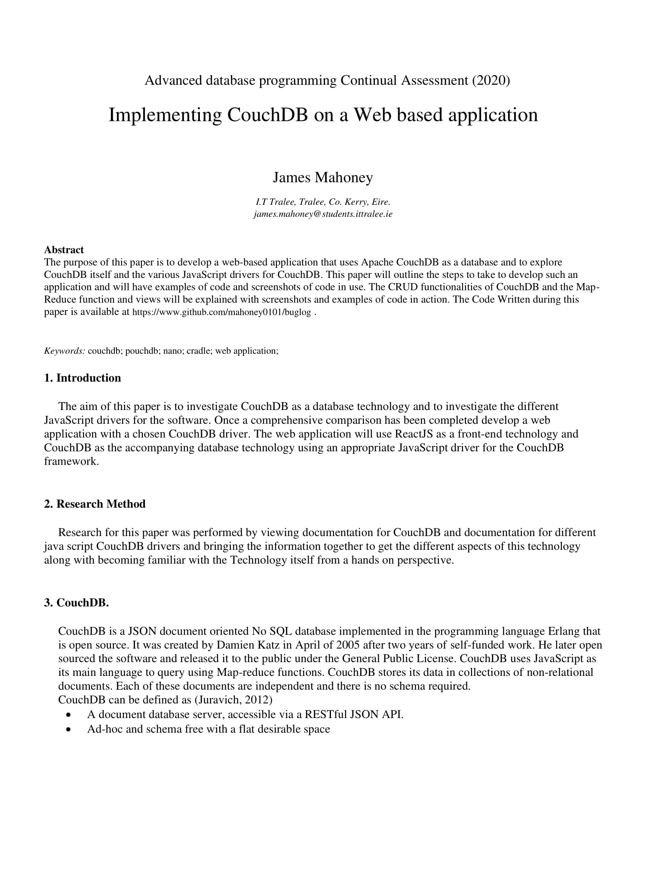
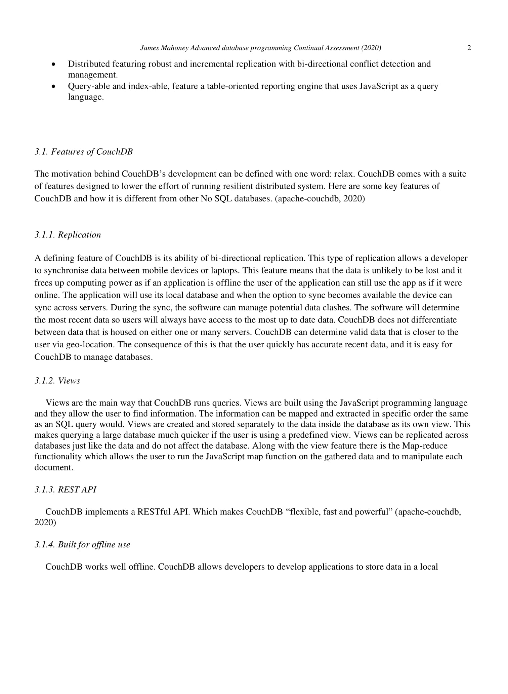
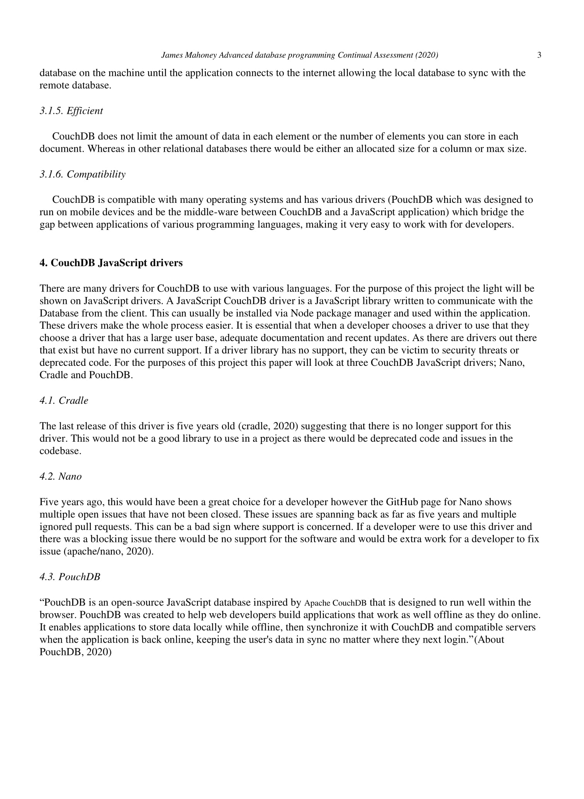
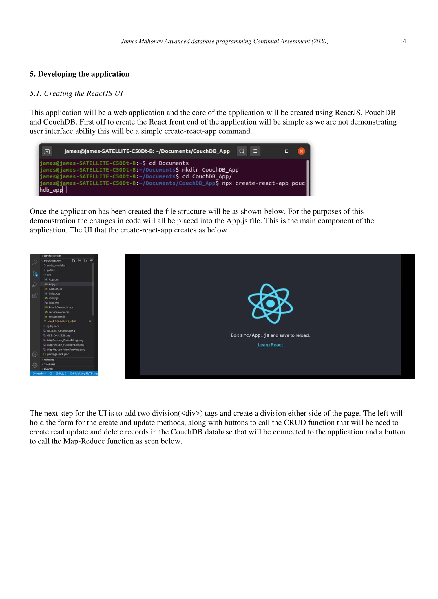
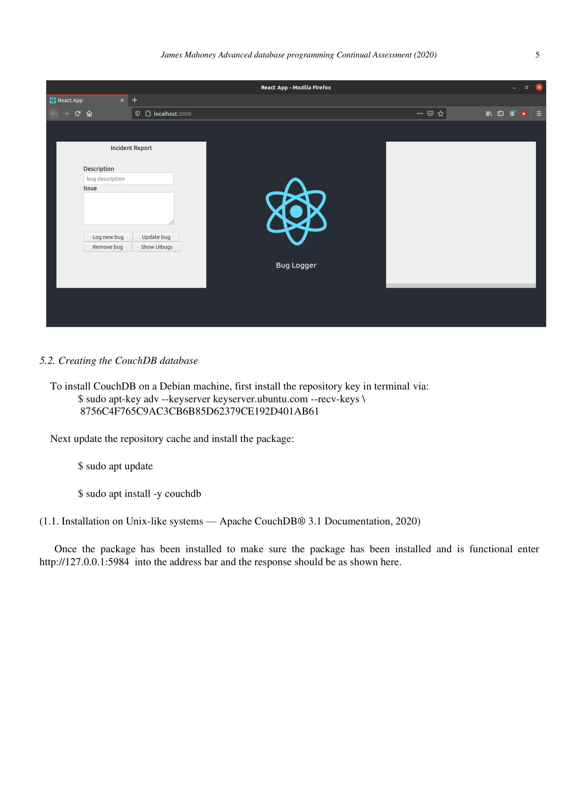
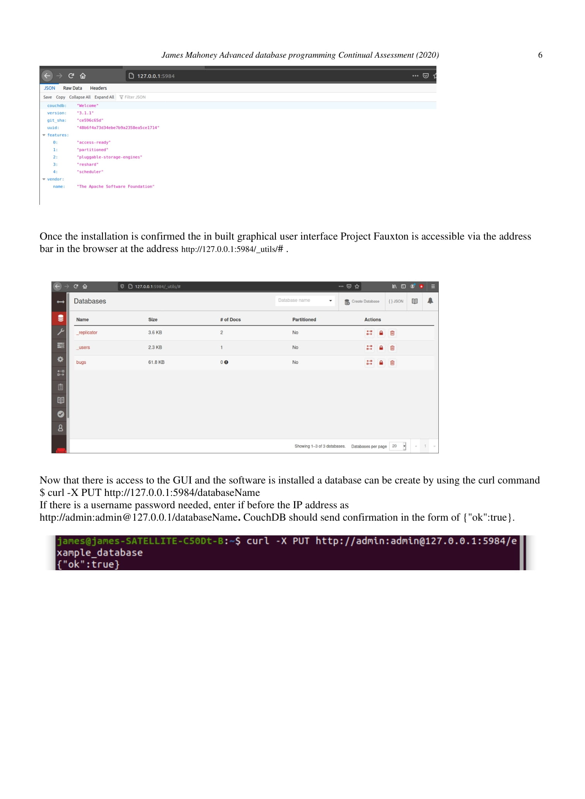
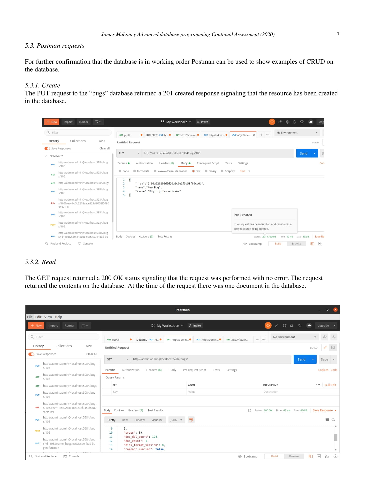
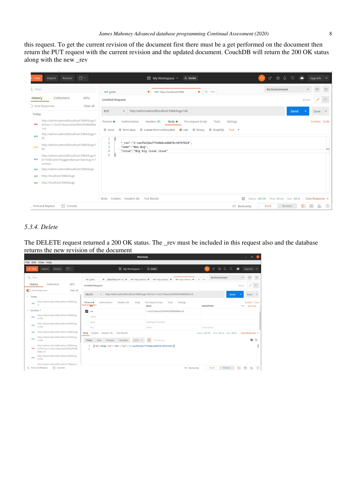
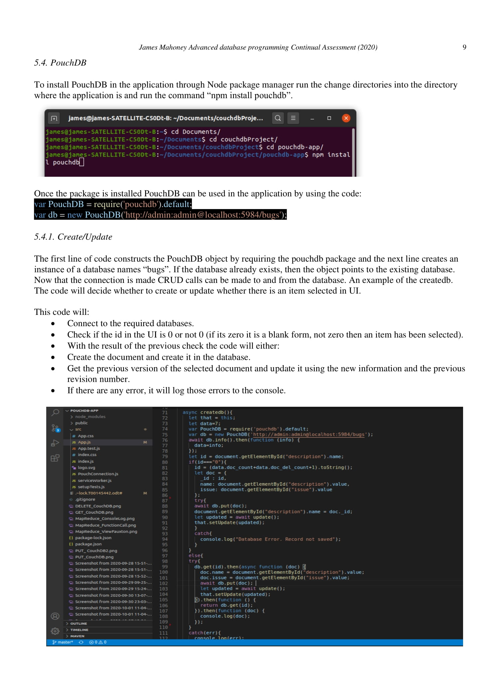
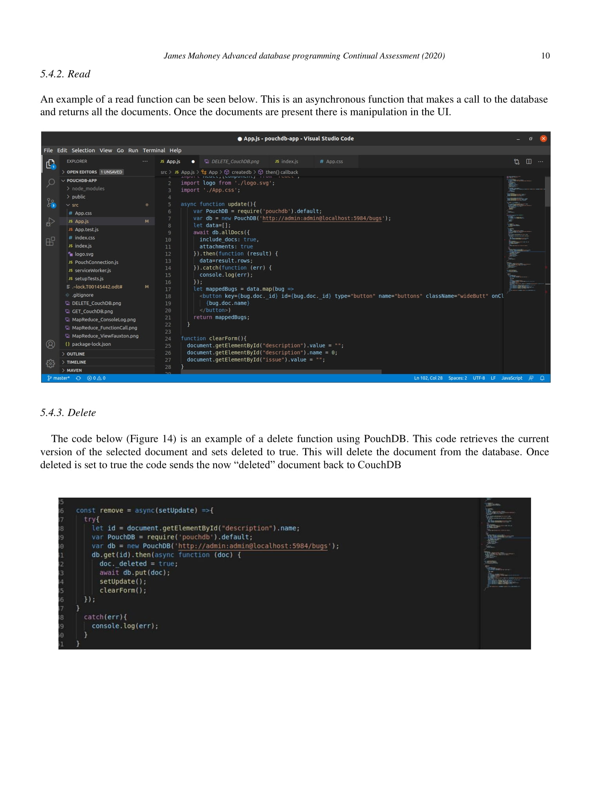
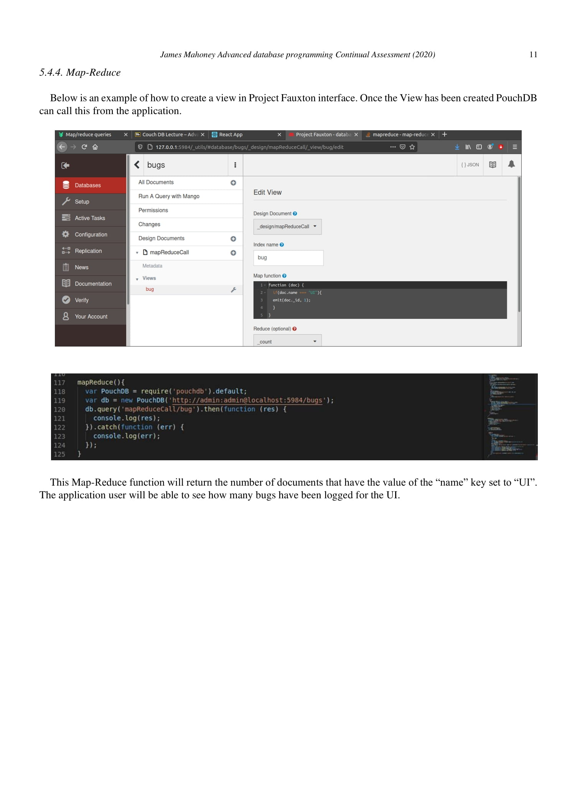
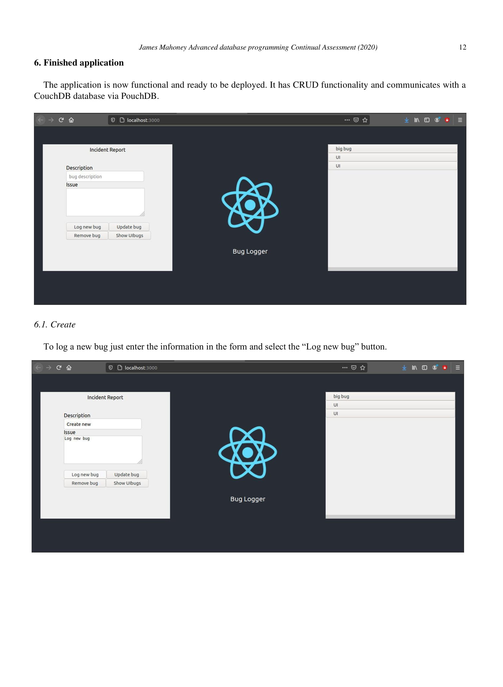
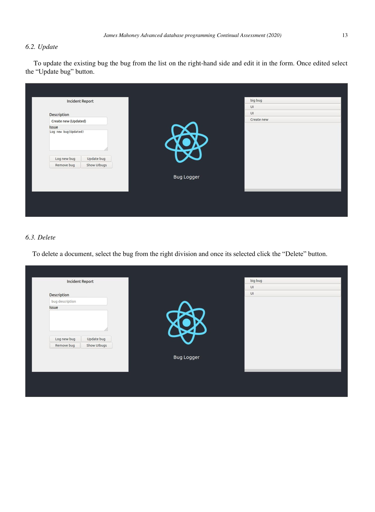
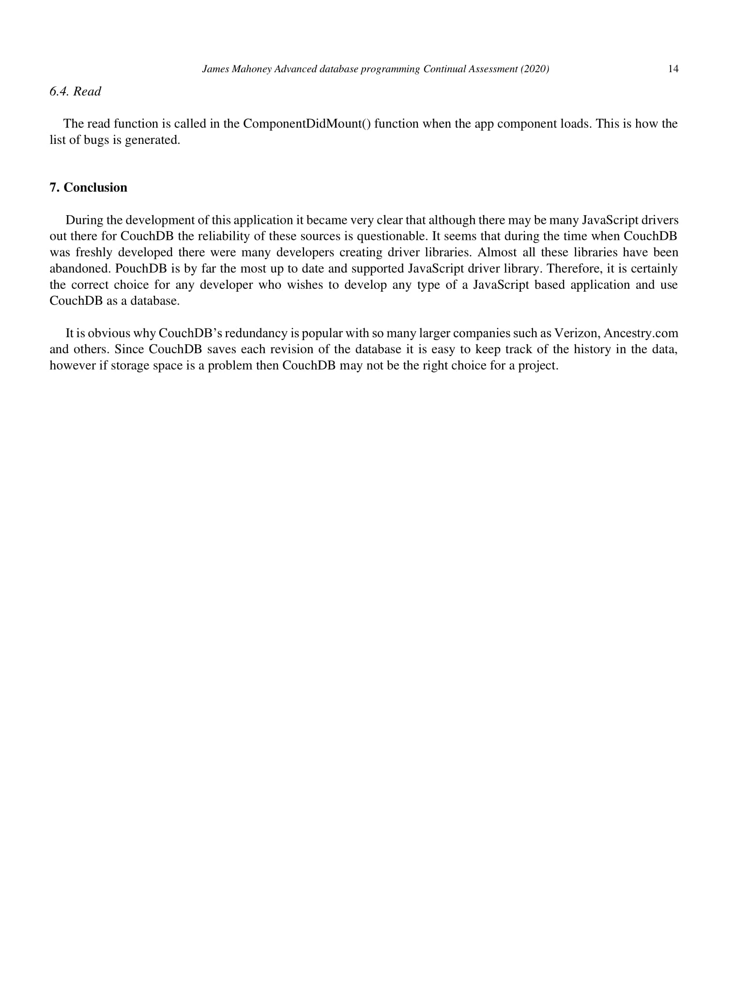
